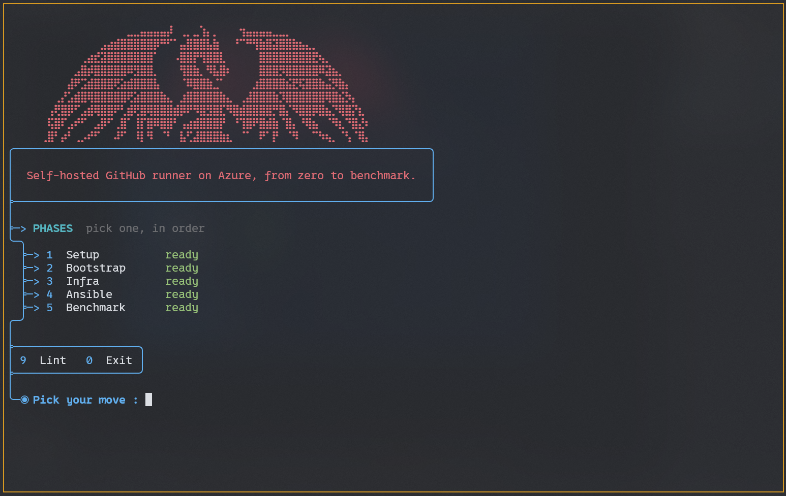

<br/>

<p align="center">
  
</p>

<h1 align="center">Self-hosted GitHub Runner on Azure</h1>

<p align="center">
  <i>A GitHub Actions runner on your own Azure VM: Terraform builds it, Ansible registers it with your organization or repository, and the toolkit measures how long your pipelines take on it</i>
</p>

<br/>

---

<br/>

## The toolkit

`make` opens the menu. Each phase builds on the previous one, `Setup` asks everything once and can run the others in a row.

| Phase | Role |
| --- | --- |
| `Setup` | Asks the four values of `.env`, picked from lists, checks the GitHub token |
| `Bootstrap` | SSH key of the `ansible` account, kept on your machine |
| `Infra` | Network and runner VM, with Terraform on an HCP Terraform backend |
| `Ansible` | Installs the runner and registers it with your target |
| `Benchmark` | Logs and total CI duration of any run, to the millisecond |

<p align="center">
  
</p>

<br/>

---

<br/>

## Setup

Prerequisites: `az`, `gh`, `terraform`, `ansible` and `jq`, an Azure resource group you can deploy into, an [HCP Terraform](https://app.terraform.io) organization for the state.

```bash
az login && gh auth login && terraform login
make setup
```

The runner serves the target you pick, not this repository: your project repository (personal or in an organization) or a whole organization. You need admin rights on it. Setup opens a prefilled token page for that target, then checks the token with GitHub before saving it.

`.env` stays on your machine, ignored by git. To fill it by hand, copy [`.env.example`](.env.example), each value is explained there.

<br/>

---

<br/>

## Use it in a workflow

Any repository covered by the target sends its jobs to the runner with its labels:

```yaml
jobs:
  build:
    runs-on: [self-hosted, Linux, X64]
    if: github.event_name != 'pull_request' || github.event.pull_request.head.repo.full_name == github.repository
```

The `if` keeps pull requests from forks off the VM. An organization runner group refuses public repositories by default, their jobs then wait forever: Setup offers to allow them.

<br/>

---

<br/>

## Change the target

Run `make setup` again with the new target, then `make ansible-apply`. Ansible sees the runner is registered elsewhere, drops that registration and registers it again, the VM stays. The runner is named after its VM (`vm-runner-<machine id>`), so several people can register theirs in the same organization.

<br/>

---

<br/>

## Benchmark

```bash
make bench-runs
make bench-metrics RUN=<id>
```

Pick a repository and a run in the menu, or pass `REPO=<owner/name>` on the command line. The GitHub API only gives seconds, so the total comes from the log archive of the run: from the moment GitHub queues the job to the last line written by the runner.

```
==> Total CI duration
  OK  3.657s, job queued at 13:58:18.004, last runner line at 13:58:21.661 UTC
    GitHub API, to the second: 11s from trigger to job end, log upload included
```

<br/>

---

<br/>

<p align="center"><sub>Brief in <a href="docs/CONSIGNES.md">docs/CONSIGNES.md</a></sub></p>
